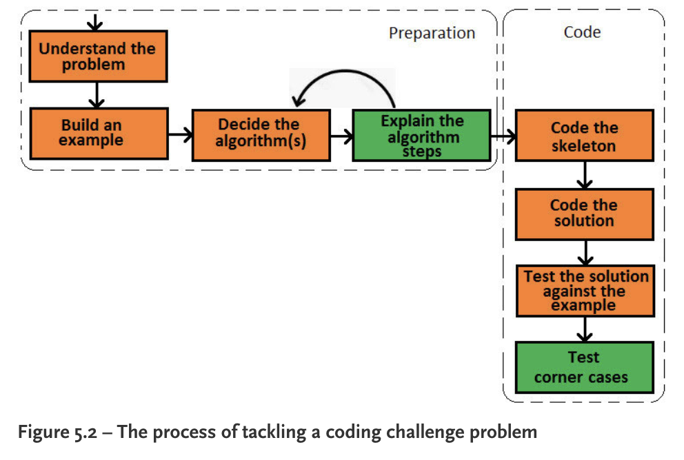

## The Complete Coding Interview Guide in Java

- *Understand the problem* - ask questions, don't solve the problem immediately
- *Build an example* - expected input & output
- *Code the skeleton* - define classes, interfaces

### Technical questions

OOP core principles:

- Object
- Class

- Abstraction

  Abstraction exposes the user only to the things that are relevant to them and hides the remainder of the details. In OOP terms, we say that an object should expose to its users only a set of high-level operations, while the internal implementation of those operations is hidden.

- Encapsulation

- Inheritance

- Polymorphism

- Association 

  Незалежний зв'язок між двома об'єктами, може бути unidirectional, bidirectional, one-to-one, one-to-many, many-to-many
  `Address` і `Person` це bidirectional many-to-many

- Aggregation

  Special case of unidirectional association
  Two aggregated objects have their own life cycle, but one of the objects is the owner of the HAS-A relationship.

- Composition

  More strict aggregation
  Two aggregated objects have their own life cycle, but one of the objects is the owner of the HAS-A relationship.

SOLID: SRP, OCP, LSP, ISP, DIP