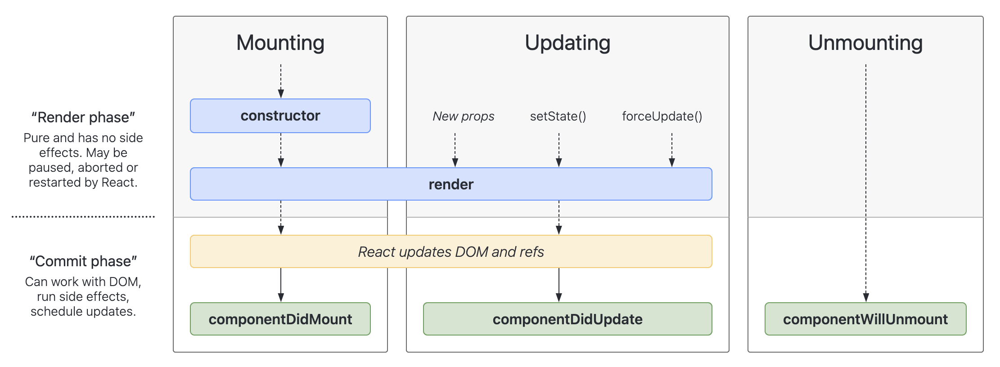

## React course Notes

May use .js instead of .jsx (like in App.js), because babel will analyze the code and still see that .js uses jsx code, so it will process it.

When you change completely some variable in state then the React app will re-render;

run order: 

1. constructor()
2. render()
3. componentDidMount()

When props or state changes = re-render.

Components lifecycle:



Components based vs Functional:

- Different lifecycle strategies - in functional we use hooks, impure functions; in components use constructors, classes, method overriding
- State in component based is an object, in functional, useState() value will be string or other but not object (so we'll have one big object state in components, many little useState() values in func)
- When we update some state, in components we only run componentDidUpdate(), in functional we run the whole function (like App())
- When in functional we try to set the same state value, it won't actually do it and it won't re-render component

`React.StrictMode` - do not use any deprecated methods of React

##### DOM and Virtual DOM

Itself making changes in Real DOM is expensive, but using Virtual DOM (a Javascript representation) we may optimize it significantly:

- First we have Real DOM and Virtual DOM Snapshot, which represents it
- When we change state, we create a copy of current Virtual DOM Snapshot
- We see what needs to be re-rendered top-down (from the component where state changed) and we compare this DOM Copy to existing Virtual DOM Snapshot 
- All these things that are different, we make batches of operations (they are very optimized) and apply them to the Real DOM

##### Promise

So what we're getting with this Promise is control over what we want to do with asynchronous events - if they succeed or fail.

```javascript
const myPromise = new Promise((resolve, reject) => {
  setTimeout(() => {
    resolve('I have succeeded');
  }, 1000);
});
myPromise
  .then(value => value + '!!!!') // return value and wrap it in a resolved promise, so chain of then() continues
	.then(newValue => console.log(newValue))
  .catch(rejectecValue => console.log(rejectedValue));
```


1. Sign in with a Google redirect, redirect to that page, login, return back
2. Application will be remounted, on mount we'll run useEffect()

##### React Contexts

If we hook our component to a context (with value, and setStateValue), and the value will change, the component will re-render. It may be not great if we'll have 100 components and value just changed - all 100 components should be re-rendered now.

##### Observer

Building a listener with callbacks:

```javascript
onAuthStateChanged(auth, callback, errorCallback, completedCallback);
/**
next: callback
error: errorCallback
complete: completedCallback
**/
```

##### Typescript

`type` does not support extend and interfaces overlaps like `interface` does.

Golden rule: if write more functional style code then use types, if more object oriented - interfaces.
